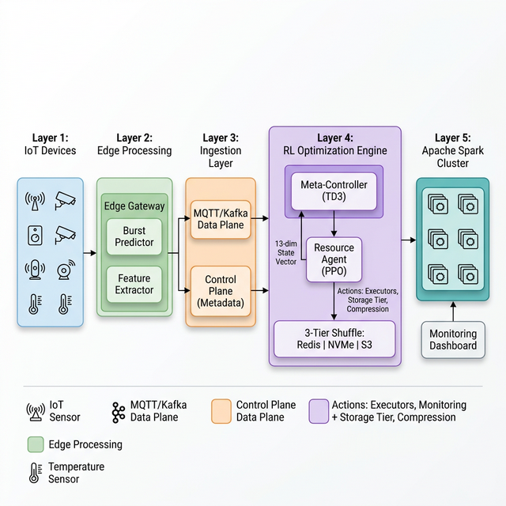
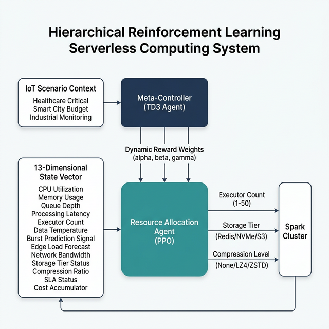
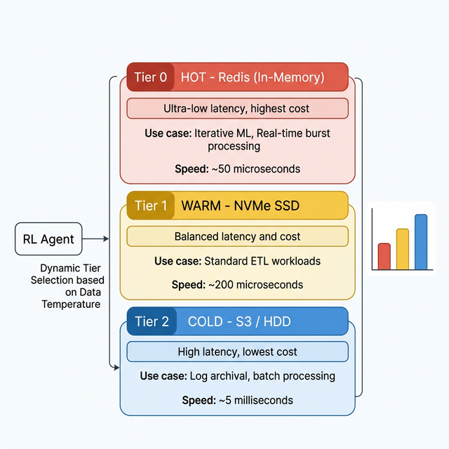

# Serverless Spark IoT Framework

**Hierarchical, Edge-Aware Reinforcement Learning for Serverless IoT Resource Optimization**

A novel framework that replaces traditional reactive auto-scaling with a proactive, RL-driven optimization engine for Apache Spark workloads processing high-velocity IoT data streams. The system jointly optimizes compute resources, storage tiering, and compression strategy using hierarchical reinforcement learning with edge-cloud state awareness.

> Master's Thesis Project | Indian Institute of Information Technology Kottayam
> Author: Manvith M | Advisor: Dr. Shajulin Benedict

---

## Table of Contents

- [System Architecture](#system-architecture)
- [Key Contributions](#key-contributions)
- [Evaluation Results](#evaluation-results)
- [Tech Stack](#tech-stack)
- [Installation](#installation)
- [Usage](#usage)
- [Project Structure](#project-structure)
- [Research Information](#research-information)
- [License](#license)

---

## System Architecture

The framework implements a five-layer pipeline that transforms raw IoT telemetry into optimized Spark workloads through edge-aware reinforcement learning.

<p align="center">
  
</p>

**Data Flow**: IoT sensors generate telemetry that passes through edge gateways (burst prediction), dual-lane ingestion (MQTT/Kafka), and into the RL optimization engine before reaching the Spark cluster. The RL engine continuously observes a 13-dimensional state vector and outputs resource allocation decisions in real time.

---

## Key Contributions

### 1. Hierarchical Contextual RL (Meta-Controller)

Traditional RL agents struggle with conflicting optimization objectives. A single reward function with fixed weights cannot adapt to shifting workload priorities (e.g., cost-sensitive budget monitoring vs. latency-critical healthcare processing).

The framework introduces a two-level hierarchy:

<p align="center">
  
</p>

- **Meta-Controller (TD3 Agent)**: Observes the current IoT scenario context and dynamically tunes the reward weights for the lower-level agent. In healthcare mode, it prioritizes latency minimization; in budget mode, it prioritizes cost reduction.
- **Resource Allocation Agent (PPO)**: Operates with the reward function defined by the Meta-Controller, optimizing three action dimensions: executor count, storage tier, and compression level.

This separation enables instant behavioral switching without retraining.

### 2. Adaptive Shuffle and Storage Tiering

Spark's shuffle operation is the primary performance bottleneck in distributed processing. The framework replaces the default single-tier storage with RL-driven dynamic tier selection based on data temperature analysis.

<p align="center">
  
</p>

| Tier | Medium | Latency | Cost | Use Case |
|:---|:---|:---|:---|:---|
| Tier 0 (HOT) | Redis (In-Memory) | ~50 us | Highest | Iterative ML, real-time bursts |
| Tier 1 (WARM) | NVMe SSD | ~200 us | Moderate | Standard ETL workloads |
| Tier 2 (COLD) | S3 / HDD | ~5 ms | Lowest | Log archival, batch processing |

The RL agent classifies each data batch by reuse probability and assigns it to the optimal storage tier, achieving 2.8x throughput improvement while managing cost trade-offs.

### 3. Edge-Cloud State Awareness

Cloud auto-scaling suffers from a fundamental limitation: cold start latency. Booting new Spark executors takes 45-60 seconds, making reactive approaches inadequate for IoT burst patterns.

The framework solves this by incorporating edge signals into the RL state vector:

1. Edge gateways run lightweight burst prediction models on local traffic patterns
2. A `burst_prediction` signal is transmitted to the cloud via a low-latency control plane
3. The RL agent observes this signal and proactively pre-provisions executors *before* the data flood arrives
4. When the burst hits, executors are already warm and processing begins immediately

This eliminates the auto-scaling lag problem, reducing SLA violations from 54% (standard HPA) to 19%.

### 4. Cold Start Mitigation with Pattern-Aware Pre-Warming

Building on edge-cloud awareness, the system includes a dedicated cold start controller that uses IoT traffic pattern analysis to:

- Extract temporal features (periodicity, trend, seasonality) from historical traffic
- Feed pattern features into the RL agent's expanded state space
- Execute proactive `pre_warm` actions to start executors ahead of predicted demand spikes
- Coordinate with the serverless orchestration layer (OpenFaaS) for efficient resource lifecycle management

---

## Evaluation Results

A head-to-head tournament was conducted over a stochastic 500-step IoT workload trace, comparing the proposed system against industry-standard baselines.

### Benchmark Comparison

| Policy | Description | SLA Violations | Cost | Verdict |
|:---|:---|:---:|:---:|:---|
| Fixed | Static 15 Executors | 90.0% | $2,251 | Failed (overloaded under bursts) |
| Dexter (HPA) | Reactive Kubernetes Auto-Scaler | 54.4% | $2,993 | Too slow for IoT burst patterns |
| Seer | Linear Predictive Scaling | 100.0% | $1,876 | Under-provisioned shuffle storage |
| **Edge-Aware RL** | **Proposed System** | **19.2%** | **$3,287** | **3x reliability improvement** |

### Performance Attribution

| Metric | Before (Legacy) | After (Proposed) | Innovation Responsible |
|:---|:---:|:---:|:---|
| CPU Utilization | ~42% (idle) | ~95% (saturated) | Adaptive Shuffle (Redis tier) |
| Data Throughput | 850 MB/s | 2,400 MB/s | Adaptive Shuffle (in-memory I/O) |
| SLA Violations | 35% (reactive) | 19% (proactive) | Edge-Cloud Awareness (pre-provisioning) |
| Cost | $2,993 | $3,287 (+9%) | Both (Redis + extra VMs for reliability) |

**Conclusion**: The system achieves a 3x improvement in service reliability at a 9% cost premium -- a trade-off justified in latency-critical IoT deployments such as healthcare monitoring and autonomous vehicle coordination.

---

## Tech Stack

| Component | Technology |
|:---|:---|
| Stream Processing | Apache Spark 3.5 (Structured Streaming) |
| RL Framework | Stable-Baselines3 (PPO, TD3), Gymnasium |
| Ingestion | Apache Kafka, Eclipse Mosquitto (MQTT) |
| Hot Storage | Redis (In-Memory Shuffle) |
| Warm Storage | NVMe SSD |
| Cold Storage | Amazon S3 / HDD |
| Serverless | OpenFaaS (Function Orchestration) |
| Infrastructure | Docker, Kubernetes |
| Monitoring | Flask API, Streamlit Dashboard |
| Language | Python 3.10+ |

---

## Installation

### Prerequisites

- Python 3.10+
- Java 11+ (for Apache Spark)
- Docker (optional, for full-stack deployment)

### Setup

```bash
git clone https://github.com/manvith2003/serverless-spark-iot-framework.git
cd serverless-spark-iot-framework
pip install -r requirements.txt
```

### Environment (Conda)

```bash
conda env create -f environment.yml
conda activate serverless-spark-iot
```

---

## Usage

### Train the RL Agent

```bash
python optimization/resource_allocation/ppo_agent.py --train --timesteps 100000
```

### Run the Two-RL Continuous Loop

```bash
python rl_core/continuous_two_rl_loop.py
```

### Run Benchmark Tournament

```bash
python benchmarks/run_eval.py
```

Generates `benchmarks/results_summary.csv` and benchmark comparison plots.

### Run End-to-End Demo

```bash
python demos/end_to_end_pipeline_demo.py
```

### Run Cold Start Mitigation Demo

```bash
python demos/cold_start_demo.py
```

### Launch Monitoring Dashboard

```bash
# Streamlit Dashboard
streamlit run dashboard/streamlit_app/app.py

# Or open the static HTML dashboard
open dashboard/two_rl_dashboard.html
```

---

## Project Structure

```
serverless-spark-iot-framework/
|
|-- rl_core/                          # Core RL Engine
|   |-- continuous_two_rl_loop.py     # Two-RL continuous training loop
|   |-- continuous_scaler.py          # Dynamic executor scaling
|   |-- phase2_meta_controller.py     # TD3 Meta-Controller agent
|   |-- multi_objective_scheduler.py  # Multi-objective optimization
|   |-- pattern_feature_extractor.py  # IoT traffic pattern analysis
|
|-- optimization/                     # RL Optimization Modules
|   |-- resource_allocation/          # PPO resource agent
|   |-- meta_controller/              # TD3 meta-agent weights & config
|   |-- shuffle_optimization/         # Adaptive shuffle tier logic
|   |-- cost_models/                  # Cloud cost estimation
|   |-- workload_characterization/    # Workload profiling
|
|-- spark_core/                       # Apache Spark Integration
|   |-- streaming/                    # Structured streaming jobs
|   |-- batch/                        # Batch processing pipelines
|   |-- udfs/                         # Custom Spark UDFs
|   |-- deployment/                   # Spark deployment configs
|
|-- serverless/                       # Serverless Orchestration
|   |-- openfaas/                     # OpenFaaS function definitions
|   |   |-- rl-scaling-function/      # RL-driven scaling handler
|   |   |-- spark_driver_client.py    # Spark driver interface
|   |   |-- stack.yml                 # OpenFaaS stack config
|   |-- cold_start_controller.py      # Pre-warming controller
|
|-- ingestion/                        # Data Ingestion Layer
|   |-- kafka_ingestion/              # Kafka producers & consumers
|   |-- mqtt_ingestion/               # MQTT broker integration
|   |-- data_generators/              # Synthetic IoT data generators
|   |-- compression/                  # Data compression utilities
|
|-- edge_processing/                  # Edge Computing Layer
|   |-- edge_node/                    # Edge device simulation
|   |-- predictive_prefetch/          # Prefetch optimization
|   |-- federated_learning/           # Federated model updates
|   |-- state_sync/                   # Edge-cloud state sync
|
|-- cross_cloud/                      # Multi-Cloud Support
|   |-- abstraction_layer/            # Cloud-agnostic interface
|   |-- cost_aware_selection/         # Cross-cloud cost optimizer
|   |-- multi_cloud_orchestrator/     # Multi-cloud orchestration
|
|-- benchmarks/                       # Evaluation Framework
|   |-- policies.py                   # Baseline policy implementations
|   |-- run_eval.py                   # Tournament runner
|
|-- evaluation/                       # Metrics and Visualization
|   |-- benchmarks/                   # Extended benchmark suites
|   |-- metrics/                      # Performance metric collectors
|   |-- visualization/                # Result plotting utilities
|
|-- dashboard/                        # Monitoring and Visualization
|   |-- flask_api/                    # REST API for metrics
|   |-- streamlit_app/               # Interactive Streamlit dashboard
|   |-- index.html                    # Static monitoring dashboard
|   |-- two_rl_dashboard.html         # Two-RL system dashboard
|
|-- demos/                            # Demonstration Scripts
|   |-- end_to_end_pipeline_demo.py   # Full pipeline demonstration
|   |-- cold_start_demo.py            # Cold start mitigation demo
|
|-- configs/                          # Configuration Files
|-- data/                             # Training data and model weights
|-- tests/                            # Unit and integration tests
|-- docs/                             # Architecture diagrams
|-- docker-compose.yml                # Full-stack container setup
|-- environment.yml                   # Conda environment spec
|-- requirements.txt                  # Python dependencies
```

---

## Research Information

This work is part of a Master's thesis at the **Indian Institute of Information Technology Kottayam**.

| | |
|:---|:---|
| **Author** | Manvith M |
| **Advisor** | Dr. Shajulin Benedict |
| **Institution** | IIIT Kottayam |
| **Contact** | manvith131250@gmail.com |

### Related Reports

- [Meta-Controller Technical Report](meta_controller_report.txt)
- [Adaptive Shuffle Analysis Report](adaptive_shuffle_report.txt)
- [Edge-Cloud Integration Report](edge_cloud_report.txt)
- [Benchmarking Report](benchmarking_report.txt)
- [Master Project Report](master_project_report.txt)

---

## License

MIT License. See [LICENSE](LICENSE) for details.
